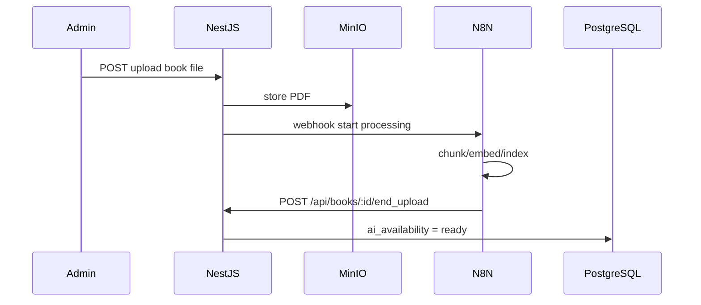

# Отчет по проекту Abai Library

**Дата аудита:** 18 мая 2026  
**Объект:** репозиторий `Abai-Library` (папки `frontend/`, `backend/`)  
**Метод:** статический анализ исходного кода без изменений и без запуска сервисов.

> **Важно:** в запросе описана целевая архитектура (next-intl, orval, MinIO, N8N, CRUD книг, `ai_availability`, `POST /api/books/:id/end_upload`). В **текущем рабочем дереве** большая часть этого **отсутствует**. Ниже зафиксировано только то, что подтверждается файлами, с явной пометкой «требует проверки» / «не найдено в репозитории», где уместно.

---

## 1. Общая информация о проекте

### Структура репозитория

| Часть | Путь | Стек (фактически в `package.json`) |
|--------|------|-------------------------------------|
| Frontend | `frontend/` | Next.js **14.2.18**, React 18, TypeScript, Tailwind 3, shadcn/ui (частично), `pdfjs-dist` / `react-pdf` |
| Backend | `backend/` | NestJS **11**, TypeScript, Prisma **7.5**, PostgreSQL (миграция), Redis (зависимости + код в `dist/`) |

Проект переведён из монорепозитория «всё в корне» в раздельные `frontend/` и `backend/` (по `git status`: старые файлы в корне помечены как удалённые).

### Расхождение «описание vs код»

| З заявлено в ТЗ аудита | Найдено в репозитории |
|------------------------|------------------------|
| `frontend/src/modules` | **Не найдено** — модульной структуры `src/modules` нет |
| next-intl | **Не найдено** в `frontend/package.json` |
| orval | **Не найдено** |
| MinIO | **Не найдено** |
| N8N / webhooks | **Не найдено** |
| Модель Book, `ai_availability`, `end_upload` | **Не найдено** |
| Полный NestJS backend (книги, загрузка) | В `backend/src/` — **только заготовка**; auth/users — **только в `backend/dist/`** |

### Краткий вывод

- **Frontend** — зрелый UI-каталог на статических данных (~14 книг), PDF-читалка, демо AI-чат, без связи с API бэкенда.
- **Backend** — в `src/` фактически сброшен до NestJS starter; **рабочая логика auth/Redis/Prisma есть только в скомпилированном `dist/`**, исходники модулей (`auth`, `users`, `prisma`) в `src/` **отсутствуют**.
- **AI/N8N** — на фронте имитация ответов; интеграций с N8N в коде нет.

---

## 2. Текущее состояние Frontend

### 2.1 Реализовано

#### Страницы (App Router, `frontend/app/`)

| Маршрут | Файл | Статус |
|---------|------|--------|
| `/` | `app/page.tsx` | Главная: hero, популярные книги, рекомендации, новинки, коллекции, промо ИИ |
| `/catalog` | `app/catalog/page.tsx` | Каталог с секциями и категориями |
| `/book/[slug]` | `app/book/[slug]/page.tsx` | Карточка книги |
| `/book/[slug]/read` | `app/book/[slug]/read/page.tsx` | Читалка PDF (canvas + pdf.js) |
| `/assistant` | `app/assistant/page.tsx` | Страница общего ИИ-помощника |
| `/about` | `app/about/page.tsx` | Развёрнутая маркетинговая страница «О проекте» |
| `/profile` | `app/profile/page.tsx` | Заглушка «В разработке» |
| `/login` | `app/login/page.tsx` | UI формы входа (shadcn) |
| `/signup` | `app/signup/page.tsx` | UI формы регистрации |
| API | `app/api/books/[slug]/pdf/route.ts` | Отдача PDF из `frontend/pdfBooks/` |

#### Каталог книг

- Источник данных: **`frontend/data/books.ts`** — массив `books` (14 записей), тип `Book`, хелперы (`getBookBySlug`, `getCatalogDisplayOrder`, фильтры для секций каталога).
- Обложки: локальные файлы в `frontend/public/` или плейсхолдер `BookCoverPlaceholder`.
- PDF: поле `pdfPath` → файлы в `frontend/pdfBooks/`.
- Контент страницы книги (цитаты, «ИИ-анализ», отзывы): **`frontend/data/bookPageContent.ts`**.

#### Страница книги

Сборка в `app/book/[slug]/page.tsx`:

- `BookHero` — обложка, рейтинг, CTA «Читать», нерабочие кнопки «библиотека / поделиться / аудио / избранное».
- `BookAIChat` — чат (демо).
- `BookDescription`, блоки цитат и статического «ИИ-анализа».
- `BookReviews`, `BookComments` (localStorage).
- `BookInfoSidebar`, `SimilarBooksSection`.

#### AI-чат по книге (фактически)

- Компонент: **`frontend/components/BookAIChat.tsx`**
- Поведение: локальный state, `setTimeout` с фиксированным текстом «Это демо‑ответ…»; начальные сообщения из props `exampleQuestion` / `exampleResponse` (из `bookPageContent.ts`).
- **Нет** HTTP-вызовов к backend/N8N.

#### Общий ИИ-помощник

- **`frontend/components/AssistantChat.tsx`** — та же схема демо-ответа.
- Страница: `app/assistant/page.tsx`.

#### Локализация

- Язык интерфейса: **только русский** в контенте страниц (`layout.tsx`: `lang="ru"`).
- **next-intl не подключён** — нет `i18n`, `[locale]`, файлов переводов.
- Формы login/signup: **английский** текст в `login-form.tsx`, `signup-form.tsx` (несогласованность с остальным UI).

#### Готовые UI-компоненты (`frontend/components/`)

| Компонент | Назначение |
|-----------|------------|
| `Header`, `Footer`, `Navigation` | Шапка/подвал (Navigation в layout не подключён) |
| `SearchBar` | Поле поиска (без логики фильтрации по умолчанию) |
| `BookCard`, `BookGridSection`, `CategoryCard`, `PromoBanner` | Каталог |
| `BookHero`, `BookCoverPlaceholder`, `BookDescription`, … | Страница книги |
| `AssistantChat`, `BookAIChat` | Демо-чаты |
| `UserProfile` | Карточка профиля (не используется на `/profile`) |
| `components/ui/*` | button, card, dialog, field, input, label, separator, textarea |

#### PDF-читалка

- `read/page.tsx`: динамический import `pdfjs-dist`, worker с **unpkg CDN**.
- Fallback: iframe при ошибке canvas.

---

### 2.2 Частично реализовано

| Область | Детали |
|---------|--------|
| Поиск | `SearchBar` есть на главной и в каталоге, но **`onSearch` не передаётся** — submit ничего не фильтрует |
| Фильтры каталога | Кнопки «Популярные / Новинки» без обработчиков; ссылки `?cat=abai` и т.д. **не читаются** (`catalog/page.tsx` — server component без `searchParams`) |
| Авторизация UI | Страницы `/login`, `/signup` есть, формы **без `action`/fetch**, ссылки `#` |
| Профиль | Компонент `UserProfile.tsx` готов, страница `/profile` — заглушка |
| Отзывы | `BookReviews` — статические данные из `bookPageContent.ts` |
| Комментарии | Работают только в **localStorage** (`BookComments.tsx`) |
| shadcn | Подключены базовые UI; не все страницы переведены на единый язык/паттерн |

---

### 2.3 Не реализовано / требует доработки

- Папка **`frontend/src/modules`** — **отсутствует** (в ТЗ указана как целевая — не реализована).
- **orval** / сгенерированный API-клиент — **отсутствует**.
- **next-intl** / мультиязычность (kk/ru/en) — **отсутствует**.
- Интеграция с NestJS backend (auth, каталог из БД) — **отсутствует**.
- Проверка **`ai_availability`** перед чатом — **отсутствует** (поля нет даже в типе `Book`).
- Админка, загрузка книг, избранное, прогресс чтения, аудио — только кнопки-заглушки в UI.
- Страницы из Footer: `/privacy`, `/terms`, `/api`, `/catalog?tab=authors` и др. — **маршрутов нет** (`frontend/app/`).
- Ссылки login/signup в Header — **нет** (есть только «Профиль»).
- `not-found.tsx`, `loading.tsx`, error boundaries — **не найдены**.

---

### 2.4 Найденные проблемы

| # | Проблема | Файлы / место |
|---|----------|----------------|
| 1 | Каталог полностью на статике; расхождение с будущим API | `data/books.ts` |
| 2 | Поиск и query-параметры каталога не работают | `SearchBar.tsx`, `catalog/page.tsx` |
| 3 | AI-чат обманывает пользователя «живым» интерфейсом при демо-ответах | `BookAIChat.tsx`, `AssistantChat.tsx` |
| 4 | PDF worker с внешнего CDN — риск CSP/офлайн/блокировок | `book/[slug]/read/page.tsx` |
| 5 | Синхронное чтение PDF в API route — нагрузка на event loop при больших файлах | `app/api/books/[slug]/pdf/route.ts` (`fs.readFileSync`) |
| 6 | Имена PDF с кириллицей/пробелами — риск на разных ОС и при деплое | `pdfBooks/`, `books.ts` |
| 7 | `BookHero` обещает «Аудио» без реализации | `BookHero.tsx` |
| 8 | FAQ на `/about` прямо говорит «демо без реального ИИ» — расходится с маркетингом на главной | `about/page.tsx` vs `page.tsx` |
| 9 | Login/signup на английском, остальной сайт на русском | `login-form.tsx`, `signup-form.tsx` |
| 10 | `Navigation.tsx` не используется в `layout.tsx` (дублирование с `Header`) | `layout.tsx`, `Navigation.tsx` |
| 11 | Нет валидации slug на уровне `generateStaticParams` — только runtime `notFound()` | `book/[slug]/page.tsx` |

---

### 2.5 Рекомендации

1. Ввести слой данных: API-клиент (orval или ручной) + env `NEXT_PUBLIC_API_URL`.
2. Реализовать рабочий поиск (клиентский фильтр как MVP, затем server search).
3. Обработать `searchParams` на `/catalog` для `cat`, `all`, табов из Footer.
4. Для AI: блокировать UI или показывать статус «ИИ готовится», когда появится `ai_availability` с backend.
5. Локализовать login/signup или подключить next-intl.
6. PDF: self-hosted worker, streaming read файла, опционально S3/MinIO URL вместо локальной папки.
7. Добавить `not-found.tsx`, связать `/profile` с `UserProfile` после auth.

---

## 3. Текущее состояние Backend

### 3.1 Реализовано

#### В `backend/src/` (актуальные исходники)

| Файл | Содержание |
|------|------------|
| `main.ts` | Минимальный bootstrap, порт `3000`, **без** Redis/CORS/префикса `api` |
| `app.module.ts` | Только `AppController` + `AppService` |
| `app.controller.ts` | `GET /` → hello |
| `prisma/schema.prisma` | Только `generator` + `datasource` (**модели User отсутствуют**) |

#### В `backend/dist/` (скомпилированный артефакт — **исходников в `src/` нет**)

Подтверждённые модули и endpoints (по `dist/src/`):

| Модуль | Endpoints (глобальный префикс `api` в `dist/src/main.js`) |
|--------|--------------------------------------------------------------|
| Auth | `POST /api/auth/register`, `POST /api/auth/login`, `POST /api/auth/logout`, `GET /api/auth/me` |
| Users | Сервис для Prisma `User` (используется Auth) |
| Prisma | `PrismaService` / `PrismaModule` |
| App | `GET /api/` (через global prefix — **требует проверки** точного пути у `AppController`) |

**Авторизация (по `dist/src/auth/auth.service.js`):**

- Регистрация: bcrypt hash, роль по умолчанию `Role.USER`, сессия `req.session.userId`.
- Логин: проверка email/password.
- Logout: destroy session + clear cookie.
- Me: `SessionAuthGuard` + загрузка пользователя.

**Сессии (по `dist/src/main.js`):**

- `express-session` + `connect-redis`, обязательный `REDIS_URL`.
- Cookie: `httpOnly`, `sameSite: 'lax'`, `secure` в production.
- CORS: `origin: http://localhost:3000`, `credentials: true`.
- `ValidationPipe` global.

**PostgreSQL / Prisma:**

- Миграция `prisma/migrations/00000000000000_init/migration.sql`: таблица `User`, enum `Role` (`USER`, `ADMIN`).
- Сгенерированный клиент в `backend/dist/generated/prisma/` содержит модель `User` (inline schema в bundle).

**Роли USER / ADMIN:**

- Enum и поле `role` в БД есть.
- При регистрации всегда `Role.USER`.
- **Отдельных guards/decorators для ADMIN в dist не обнаружено** — админ-функции не реализованы.

---

### 3.2 Частично реализовано

| Область | Статус |
|---------|--------|
| Auth stack | Логика есть в **`dist/`**, но **`src/` не собирается** в то же приложение без восстановления файлов |
| Prisma schema | Миграция и dist-клиент знают `User`, но **`prisma/schema.prisma` в репозитории пустой** (нет model) |
| Redis | Зависимости в `package.json`, настройка в `dist/main.js`, **не в `src/main.ts`** |
| Тесты | `app.controller.spec.ts`, e2e заготовка — под текущий минимальный `src` |

---

### 3.3 Не реализовано / требует доработки

В репозитории **не найдено**:

- Модуль **Books** / CRUD книг.
- **MinIO** или любое S3-совместимое хранилище.
- Загрузка файлов (multipart, presigned URLs).
- **N8N** webhooks, callback **`POST /api/books/:id/end_upload`**.
- Поле **`ai_availability`** и любая модель `Book` в Prisma.
- Rate limiting, CSRF-стратегия для cookie-auth API.
- Admin API, назначение роли ADMIN.
- `RolesGuard` / `@Roles('ADMIN')`.
- Docker Compose, `.env.example` (файлы **не найдены**).
- Исходники: `backend/src/auth/`, `users/`, `prisma/`, `common/guards/` — **отсутствуют** (есть только `dist/`).

---

### 3.4 Найденные проблемы

| # | Проблема | Критичность | Где |
|---|----------|-------------|-----|
| 1 | **Рассинхрон `src` и `dist`**: `npm run build` из текущего `src` **не воспроизведёт** auth/Redis | Критическая | `src/` vs `dist/` |
| 2 | `prisma/schema.prisma` без модели `User` — `prisma generate` / migrate из схемы **сломают** ожидания | Высокая | `prisma/schema.prisma` |
| 3 | `SESSION_SECRET` fallback `'dev-change-me'` в dist | Высокая | `dist/src/main.js` |
| 4 | CORS захардкожен на `localhost:3000` | Средняя | `dist/src/main.js` |
| 5 | Нет `@nestjs/config` в текущем `app.module` src (есть в package.json) | Средняя | `src/app.module.ts` |
| 6 | `dist/` и `generated/` в git status как untracked — риск коммита артефактов | Средняя | `backend/dist/` |
| 7 | bcrypt без политики сложности пароля на уровне DTO (только length 8–72 в login DTO) | Низкая | `dist/.../login.dto.js` |
| 8 | Дублирование сообщений об ошибке email (RU в service, EN в users catch) | Низкая | `auth.service.js`, `users.service.js` |

---

### 3.5 Рекомендации

1. **Срочно восстановить** `backend/src/auth`, `users`, `prisma`, `common/guards`, `main.ts` из VCS или dist + source maps.
2. Синхронизировать `prisma/schema.prisma` с миграцией (`User` + будущая `Book`).
3. Не хранить `dist/` в git; добавить в `.gitignore`.
4. Добавить `.env.example`: `DATABASE_URL`, `REDIS_URL`, `SESSION_SECRET`, `PORT`, `CORS_ORIGIN`.
5. Спроектировать модуль `books` + MinIO + N8N callback с подписью webhook.
6. Ввести `AdminGuard` на основе `role === ADMIN`.

---

## 4. AI и N8N интеграция

### 4.1 Что реализовано

| Компонент | Реализация |
|-----------|------------|
| UI чата по книге | `BookAIChat.tsx` — демо |
| UI общего ассистента | `AssistantChat.tsx` — демо |
| Статический «ИИ-анализ» | Тексты в `bookPageContent.ts`, блок на странице книги |
| Маркетинг про ИИ | `about/page.tsx`, главная `page.tsx` |

**В backend и frontend нет:** webhook URL, вызовов N8N, очередей обработки, статуса `ai_availability`.

### 4.2 Как работает процесс обработки книги

**В коде не реализован.** Ожидаемый процесс из ТЗ (загрузка → N8N → callback `end_upload` → обновление статуса) **требует проектирования с нуля**.

Гипотетический целевой поток (для планирования, **не из кода**):



### 4.3 Как работает AI-чат

**Фактически (frontend only):**

1. Пользователь вводит текст в `BookAIChat` или `AssistantChat`.
2. Сообщение добавляется в React state.
3. Через 600–700 ms добавляется **заранее заданный** ответ про «демо» / «подключите backend».

**Нет:** проверки авторизации, book id, session, streaming, истории на сервере.

### 4.4 Проблемы и риски

| Проблема | Описание |
|----------|----------|
| Нет `ai_availability` | Чат доступен для всех книг одинаково, вводит в заблуждение |
| Нет fallback при ошибке N8N | Нет обработки сетевых ошибок (интеграции нет) |
| Захардкоженный webhook | **Не найден** в коде; при добавлении — риск утечки URL в репозитории |
| Демо выдаёт себя за ИИ | UX/доверие; юридически спорные формулировки на главной vs FAQ |
| Нет RAG-привязки к конкретной книге | Даже после интеграции нужен `bookId` / vector store per book |

### 4.5 Что нужно доработать

1. Модель `Book` + enum статуса AI (`pending` | `processing` | `ready` | `failed`).
2. Backend endpoint: прокси чата → N8N (не вызывать N8N напрямую с браузера).
3. `POST /api/books/:id/end_upload` с секретом/signature + идемпотентность.
4. Frontend: disabled state чата + tooltip, polling или SSE статуса обработки.
5. Единый формат ошибок и user-friendly fallback сообщения.
6. Логирование и мониторинг pipeline N8N.

---

## 5. Инфраструктура и окружение

| Элемент | Статус |
|---------|--------|
| Docker / docker-compose | **Не найдено** |
| `.env.example` | **Не найдено** |
| CI (GitHub Actions и т.д.) | **Не найдено** в корне |
| Frontend dev | `npm run dev` → порт 3000 (`frontend/README.md`) |
| Backend dev | `npm run start:dev`; актуальный `src` слушает **3000**, dist — **3001** (**расхождение**) |
| PostgreSQL | Миграция init есть; `DATABASE_URL` через `prisma.config.ts` |
| Redis | Требуется для dist-сборки (`REDIS_URL`) |
| MinIO | **Не найдено** |
| N8N | **Не найдено** |
| PDF-хранилище | Локальная папка `frontend/pdfBooks/` |

**Зависимости для локального запуска полного auth (по dist):** PostgreSQL + Redis + восстановленный `src`.

---

## 6. Безопасность

| Область | Оценка |
|---------|--------|
| Auth | Session cookie + Redis (в dist) — разумная база; **исходники отсутствуют** |
| Пароли | bcrypt (dist); нет rate limit на login |
| Секреты | Fallback `SESSION_SECRET` в dist — **опасно для prod** |
| CORS | Жёсткий localhost — ок для dev, не для prod |
| PDF API | Публичный `GET` без auth — ожидаемо для публичной библиотеки; path traversal защищён slug→book mapping (**требует проверки** edge cases) |
| Frontend comments | localStorage — нет модерации, XSS при отображении текста (React экранирует — низкий риск) |
| N8N callback | **Не реализован** — при реализации нужна HMAC/shared secret |
| ADMIN | Роль в БД есть, **enforcement отсутствует** |
| Зависимости | Next 14.2.18 — **требует проверки** актуальных security advisories |

---

## 7. UI/UX замечания

1. **Единый язык:** русский контент vs английские auth-формы.
2. **Поиск:** визуально есть, функционально нет — высокий UX-разрыв.
3. **Фильтры каталога:** кликабельные, но не меняют список.
4. **ИИ:** интерфейс «как продакшен», ответы «демо» — нужен явный badge «Демо» или disabled.
5. **Профиль / избранное / аудио:** кнопки без feedback (не «скоро», а тихие no-op).
6. **Мобильная навигация:** 5 пунктов в Header без burger — на узких экранах **требует проверки** переполнения.
7. **Читалка PDF:** хороший fallback iframe; нет progress %, закладок, темы чтения.
8. **Доступность:** частичные `aria-label`; чаты без live region для новых сообщений.
9. **Footer:** ссылки на несуществующие страницы — 404.
10. **Контент About vs реальность:** честный FAQ хорош для команды, но противоречит промо на главной.

---

## 8. Архитектурные замечания

### Текущая (фактическая) архитектура

```
[Browser]
   → Next.js (статика books.ts, UI, local API PDF)
   ✗ NestJS (не подключён с фронта)

[NestJS src] → hello world only
[NestJS dist] → auth + user (orphan artifact)
[PostgreSQL] → User table (migration)
[Redis] → sessions (dist only)
```

### Целевая (из ТЗ, не в коде)

```
Next.js + orval + next-intl
    ↓ REST (cookies)
NestJS modules: auth, books, files, ai
    ↓
PostgreSQL (books, ai_availability)
MinIO (PDF)
Redis (sessions/cache)
N8N (ingestion + chat webhooks)
```

### Ключевые архитектурные долги

1. **Два источника правды для книг:** `books.ts` vs будущая БД.
2. **Отсутствие границы API** на фронте.
3. **Потеря backend sources** — главный блокер.
4. **Коммит dist** — риск ложного ощущения «всё работает».
5. PDF на файловой системе фронта не масштабируется — логично перенести в MinIO + CDN.

---

## 9. Список задач для доработки

### Срочно

- [ ] Восстановить исходники backend (`auth`, `users`, `prisma`, guards, полный `main.ts`) и синхронизировать с `prisma/schema.prisma`
- [ ] Убрать зависимость от устаревшего `dist/` как единственного источника auth
- [ ] Подключить frontend к `POST/GET /api/auth/*` (login, signup, me, logout) с `credentials: 'include'`
- [ ] Добавить `.env.example` для frontend и backend
- [ ] Пометить AI-чаты как демо или отключить до интеграции
- [ ] Исправить рабочий поиск/фильтры каталога (хотя бы client-side)

### Важно

- [ ] Спроектировать Prisma модель `Book` + `ai_availability` + файловые поля (MinIO keys)
- [ ] Реализовать CRUD книг и ADMIN guard
- [ ] MinIO: upload/download, связь с book record
- [ ] N8N: webhook старта обработки + `POST /api/books/:id/end_upload` с авторизацией
- [ ] Backend proxy для AI-чата (book-scoped)
- [ ] orval + типизированный клиент на фронте
- [ ] Перенести каталог с `data/books.ts` на API (миграция данных)
- [ ] PDF: streaming, self-hosted pdf.worker
- [ ] Страницы 404 для битых ссылок Footer; `/privacy`, `/terms`

### Можно позже

- [ ] next-intl (kk/ru/en)
- [ ] `frontend/src/modules` — feature-based структура
- [ ] Профиль: `UserProfile`, избранное, история чтения
- [ ] Модерация комментариев через API
- [ ] Аудиокниги, подписка на рассылку
- [ ] E2E тесты (Playwright) + CI
- [ ] Docker Compose (postgres, redis, minio, n8n)

---

## 10. С чего начать работу

### 1. Что проверить первым

1. Состояние git: есть ли ветка/коммит с полным `backend/src/auth/**` (восстановление).
2. Локально: поднять PostgreSQL + Redis, применить миграцию `00000000000000_init`.
3. Собрать backend из **восстановленного** `src`, сравнить с поведением `dist`.
4. Запустить frontend, пройти маршруты: `/`, `/catalog`, `/book/slova-nazidaniya`, `/book/.../read`, `/assistant`.
5. Зафиксировать список PDF, которые реально открываются (кириллические имена файлов).

### 2. Что исправить вторым

1. Восстановить backend source tree и `schema.prisma` (модель `User`).
2. Связать login/signup forms с API; русифицировать формы.
3. Client-side поиск + `searchParams` на каталоге.
4. Явный UX для демо-AI (бейдж / отключение).

### 3. Что доделать третьим

1. Модуль Books + MinIO upload.
2. N8N pipeline + `end_upload` + `ai_availability`.
3. AI chat через backend proxy + проверка статуса на фронте.
4. orval, env, CORS для prod.

### 4. Финальная полировка

- next-intl, профиль, модерация, a11y, CI/CD, оптимизация читалки, админ-панель.

---

## 11. Итоговое резюме

**Abai Library** сейчас — **сильный frontend-прототип** электронной библиотеки с 14 книгами, PDF-чтением и богатым UI, но **без реального backend-интегрирования, AI и инфраструктуры из ТЗ**.

**Backend** находится в **критическом промежуточном состоянии**: в `package.json` и `dist/` видна задумка session-auth + PostgreSQL + Redis, но **актуальный `backend/src/` — пустая заготовка NestJS**, а модели книг, MinIO и N8N **отсутствуют**.

**AI** — исключительно **клиентская имитация** в `BookAIChat.tsx` и `AssistantChat.tsx`.

**Главный риск:** команда может ориентироваться на описание полного стека, тогда как репозиторий содержит в основном UI и фрагмент auth в `dist/`.

**С чего начать:** восстановить backend `src`, подключить auth к фронту, синхронизировать Prisma, затем проектировать Books + N8N + AI status — и только потом заменять демо-чаты реальными вызовами.

---

## Чек-лист для дальнейшей работы

- [ ] Восстановить `backend/src/auth`, `users`, `prisma`, `common/guards` из VCS
- [ ] Дописать `User` в `backend/prisma/schema.prisma` и проверить `prisma migrate`
- [ ] Подключить `/login` и `/signup` к NestJS `/api/auth/*`
- [ ] Добавить `NEXT_PUBLIC_API_URL` и общий API-клиент
- [ ] Реализовать рабочий поиск и фильтры в `catalog/page.tsx`
- [ ] Добавить модель `Book` и поле `ai_availability`
- [ ] Интегрировать MinIO для хранения PDF
- [ ] Настроить N8N workflow и `POST /api/books/:id/end_upload`
- [ ] Заменить демо-логику в `BookAIChat.tsx` / `AssistantChat.tsx` на API + проверку статуса
- [ ] Убрать или пометить демо-режим ИИ в UI
- [ ] Добавить `.env.example` и docker-compose для dev
- [ ] Исключить `backend/dist/` из репозитория
- [ ] Создать отсутствующие страницы (`/privacy`, `/terms`) или убрать ссылки из `Footer.tsx`
- [ ] Русифицировать `login-form.tsx` и `signup-form.tsx`
- [ ] Реализовать страницу `/profile` с `UserProfile.tsx` после auth
